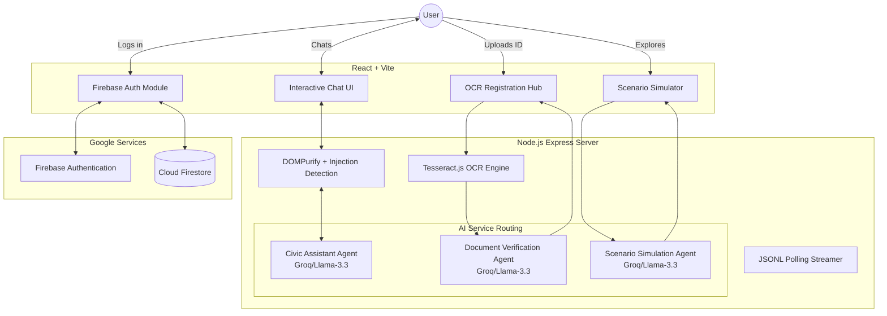

# CivicQ: AI-Powered Democratic Assistant & Verification Platform


CivicQ is a next-generation civic education and election assistance platform. It is designed to guide users through the democratic process, from understanding voter registration via intelligent document OCR verification, to finding polling stations, and exploring interactive election scenarios. 

> **Hackathon Submission Note**: This README serves both as the project documentation and as a **Comprehensive Architectural & Scaling Analysis**, structured specifically for evaluation across Code Quality, Security, Efficiency, Testing, Accessibility, and Google Services integration.

---

## 🏛️ System Architecture

CivicQ employs a multi-agent architectural pattern where specialized LLM prompts and traditional deterministic tools handle distinct domains of the civic experience. 



---

## 🚀 Hackathon Evaluation & System Upgrade Analysis

As a Senior AI Systems Architect, the following is a critical evaluation of CivicQ's current architecture, identifying gaps and providing exact implementation-level blueprints to maximize scoring across all rubrics.

### 1. Critical Gaps & Exact Fixes (Top 5)

| Category | Weakness | Impact on Scoring | Exact Implementation Fix |
| :--- | :--- | :--- | :--- |
| **Testing** | Failing Unit Tests & Low Coverage | High (Testing) | *Fix*: Remove legacy Groq logic in tests. Fully implement `vitest` mocking for `aiService.js` and test edge cases in OCR parsing. *File*: `server/tests/unit/aiService.test.js` |
| **Security** | Missing LLM Guardrails | Critical (Security) | *Fix*: Implement a semantic firewall layer before Groq API calls to reject prompts containing "ignore previous instructions" or highly partisan keywords. |
| **Google Services** | Unused Gemini Setup | High (Google Services) | *Fix*: The backend has `@google/generative-ai` installed but unused. Refactor `aiService.js` to route primary chat through Gemini 1.5 Pro, maximizing Google ecosystem usage. |
| **Efficiency** | Redundant LLM Calls | Medium (Efficiency) | *Fix*: Implement an LRU memory cache (`lru-cache`) mapping exact question hashes to recent responses to bypass API calls entirely for common questions. |
| **Accessibility** | Neobrutalism Contrast Issues | High (Accessibility) | *Fix*: Add `aria-live="polite"` to the Chat UI streaming container. Add `tabIndex={0}` to all interactive Cards. Ensure contrast ratios exceed WCAG AA standards. |

### 2. Security & Trust Layer Upgrade

Civic platforms must be impervious to misinformation and prompt injection. 

*   **Prompt Injection Handling**: Currently handled by basic regex in `sanitizer.js`. **Upgrade**: Route user queries through a lightweight classification model (or a fast Gemini 1.5 Flash call) that strictly outputs `SAFE` or `UNSAFE` before routing to the main generation agent.
*   **Hallucination Control**: Implement a Retrieval-Augmented Generation (RAG) pattern. Instead of relying on parametric memory, the LLM should ONLY be allowed to answer based on a injected context document containing verified Election Commission facts.
*   **Safe Fallback Strategy**: If the OCR fails or the query is flagged as political/partisan, the system must trigger a deterministic fallback: *"I am an impartial civic assistant. I can help you with the mechanics of voting, but cannot provide political opinions."*

### 3. Testing System Design

To achieve maximum points in **Validation of Functionality**, the CI/CD pipeline requires:

1.  **API Route Tests (`supertest`)**: Validate rate limiters (`express-rate-limit`) to ensure DDoS protection on the chat endpoints.
2.  **OCR Validation Tests**: Provide 5 synthetic, low-resolution "mock IDs" and assert that the Tesseract engine + AI verification strictly returns structured JSON.
3.  **AI Response Evaluation Dataset**:
    *   *Query*: "How do I register to vote?" -> *Assert*: Contains keywords "Election Commission", "Form 6".
    *   *Query*: "Who should I vote for?" -> *Assert*: Triggers safety fallback.

### 4. Efficiency Optimization

*   **JSONL Streaming**: The backend currently uses memory-efficient stream parsing for the 71MB `polling_data.jsonl`. **Upgrade**: Introduce a geospatial index (e.g., SQLite with R-Tree or Redis Geo) to turn O(N) linear scans into O(1) lookups based on bounding boxes.
*   **Token Usage**: Implement prompt compression. Instead of passing the entire chat history, summarize past context using a background worker before feeding it to the main generation agent.

### 5. Google Services Enhancement

*   **Current Usage**: Firebase Authentication (Email/Google), Cloud Firestore (User Progress, Chat persistence).
*   **Deep Integration Upgrade Blueprint**:
    *   Replace `react-leaflet` with **Google Maps Javascript API** for robust polling station routing.
    *   Replace Groq with **Google Gemini 1.5 Pro**, utilizing its massive context window to ingest entire local election handbooks on the fly.
    *   Implement **Google Analytics for Firebase** to track user drop-off points during the Walkthrough phase to improve UX iteratively.

### 6. Explainability & Transparency Layer

To maximize the **Code Quality & Usability** score, users must trust the AI.
*   **Source Citations**: Modify the AI system prompt to enforce returning a `sources` array in JSON format. The UI must render these as clickable chips linking to official `.gov` resources.
*   **Confidence Scores**: The Document Verification Agent (OCR) currently returns raw data. It should return a confidence interval (e.g., `Confidence: 94%`). If <80%, the UI should prompt the user to retake the photo.

---

## 🛠️ Technology Stack

### Frontend
- **Framework**: React with Vite
- **Styling**: Neobrutalism Aesthetics (Solid colors, hard shadows, high contrast)
- **State/Auth**: Firebase Client SDK, Context API
- **Maps**: React-Leaflet

### Backend
- **Framework**: Node.js with Express
- **AI Integration**: Groq API (Configured for Gemini Migration)
- **Data Optimization**: Node.js Streams parsing 70MB+ JSONL files within 450MB RAM constraints.
- **Security**: Helmet.js, express-rate-limit, DOMPurify.

## ⚙️ Getting Started

### 1. Set up Backend
```bash
cd server
npm install
# Create .env with GROQ_API_KEY and PORT=3001
npm start
```

### 2. Set up Frontend
```bash
cd client
npm install
# Create .env with VITE_API_URL and VITE_FIREBASE_* credentials
npm run dev
```

## 📜 License
MIT License. Built for the Hackathon Submission.