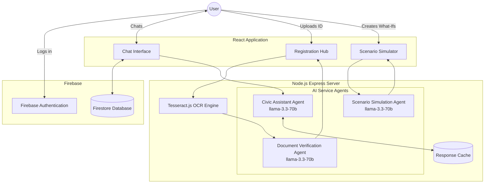

# CivicQ

CivicQ is an AI-powered civic education and election assistance platform. It is designed to guide users through the democratic process, from understanding voter registration to finding polling stations and exploring election scenarios. The application features a dynamic, multilingual interface and an intelligent chatbot to answer civic queries in real-time.

## Features

- **Multilingual AI Assistant**: An intelligent chatbot powered by Llama-3 (via Groq API) that answers election-related questions natively in English, Hindi, Marathi, Gujarati, and Kannada.
- **Smart Registration Hub**: Allows users to upload their voter ID or Aadhar card. The system uses Optical Character Recognition (OCR) via Tesseract.js to extract data and provides AI-driven validation of the document.
- **Polling Station Finder**: An interactive map integrating OpenStreetMap and Leaflet to help users locate nearby polling stations based on their geographical location, powered by highly optimized JSONL data streaming.
- **Election Walkthrough & Timeline**: Step-by-step guides and interactive timelines detailing the entire electoral process. Gamified with interactive badges synced in real-time.
- **Scenario Simulator**: A "What If" module that allows users to explore real-world election scenarios and understand their outcomes.
- **Authentication & Persistence**: Full user accounts via Firebase Auth (Email/Password & Google Sign-in) with real-time profile syncing and chat history persistence via Cloud Firestore.
- **Localization (i18n)**: Full platform internationalization, seamlessly switching the entire UI and AI context between 5 different languages.
- **Premium Neobrutalism UI**: A highly polished, interactive user interface featuring bold Neobrutalist design principles, glassmorphism accents, and micro-animations.

## Agent Architecture

CivicQ relies on a multi-agent architectural pattern where different specialized prompts and tools handle different domains of the application. 



## Technology Stack

### Frontend
- **Framework**: React with Vite
- **Styling**: Custom CSS (Neobrutalism aesthetics)
- **Mapping**: React-Leaflet
- **Localization**: react-i18next
- **Document Parsing**: pdfjs-dist
- **Authentication**: Firebase Client SDK

### Backend
- **Framework**: Node.js with Express
- **AI Integration**: Groq API (llama-3.3-70b-versatile)
- **OCR**: Tesseract.js
- **Location Services**: OpenStreetMap / Nominatim API
- **Data Optimization**: JSONL Streams for memory-efficient large dataset processing

## Prerequisites

- Node.js (v18 or higher recommended)
- A Groq API Key
- A Firebase Project (with Auth & Firestore enabled)
- An OpenL Translate RapidAPI Key (for generating translations via scripts)

## Getting Started

### 1. Clone the repository
```bash
git clone https://github.com/yourusername/civicq.git
cd civicq
```

### 2. Set up the Backend
```bash
cd server
npm install
```
Create a `.env` file in the `server` directory and add your Groq API key:
```env
PORT=3001
GROQ_API_KEY=your_groq_api_key_here
CLIENT_URL=http://localhost:5174
```
Start the backend server:
```bash
npm start
```

### 3. Set up the Frontend
Open a new terminal window:
```bash
cd client
npm install
```

Create a `.env` file in the `client` directory and add your keys:
```env
VITE_API_URL=http://localhost:3001
VITE_FIREBASE_API_KEY=your_key
VITE_FIREBASE_AUTH_DOMAIN=your_domain
VITE_FIREBASE_PROJECT_ID=your_id
VITE_FIREBASE_STORAGE_BUCKET=your_bucket
VITE_FIREBASE_MESSAGING_SENDER_ID=your_sender_id
VITE_FIREBASE_APP_ID=your_app_id
```

Start the frontend development server:
```bash
npm run dev
```

The application will be running at `http://localhost:5174`.

## Deployment

For production, it is recommended to deploy the frontend and backend separately:
- **Frontend**: Deploy the `client` directory to a static hosting service like Netlify or Vercel. Be sure to configure all `VITE_*` environment variables to point to your live backend and Firebase config.
- **Backend**: Deploy the `server` directory to a Node.js hosting provider like Render, Railway, or Heroku. Ensure all environment variables (like `GROQ_API_KEY`) are securely configured.

## License

This project is licensed under the MIT License.